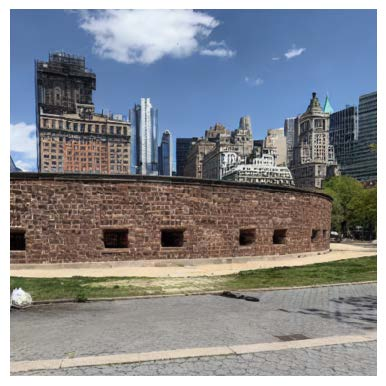

# Person Removal, E6691 Spring 2023

Visiting tourist attractions with a lot of people in your viewfinder? Our "person removal" pipeline is here to help!

The process of removing special areas from an image and repairing the missing part is known as image inpainting. In this project, we bridge the gap between advanced detection models, segmentation models, and generative models to propose an automatic pipeline for person removal.

Requirements
The libraries used for this project:
pandas, urllib.request, numpy, skimage.io, torch, matplotlib.pyplot, torchvision, pycocotools, PIL, transformers, diffusers

The project take coco dataset as the testing dataset, generated the mask by the SAM, generate prompt by the vit-gpt2 model, implaint the image with the stable diffusion model. 
